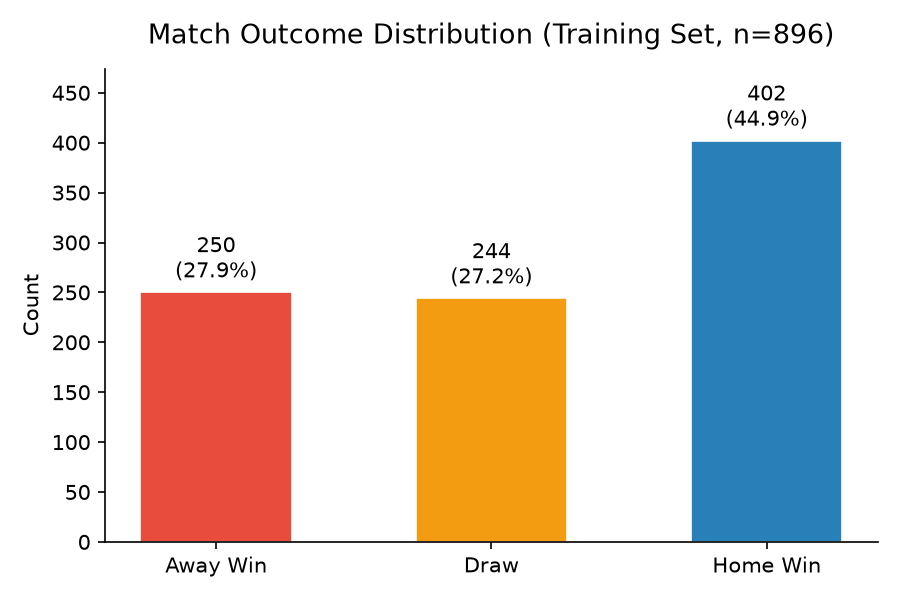
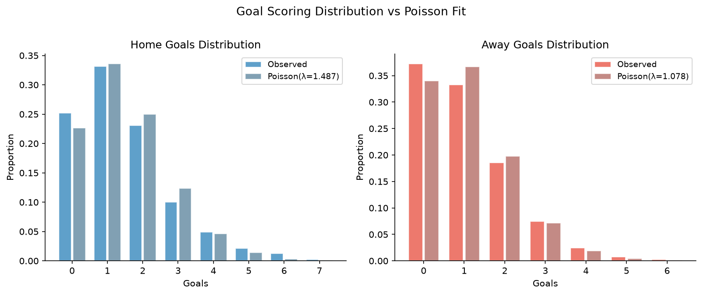
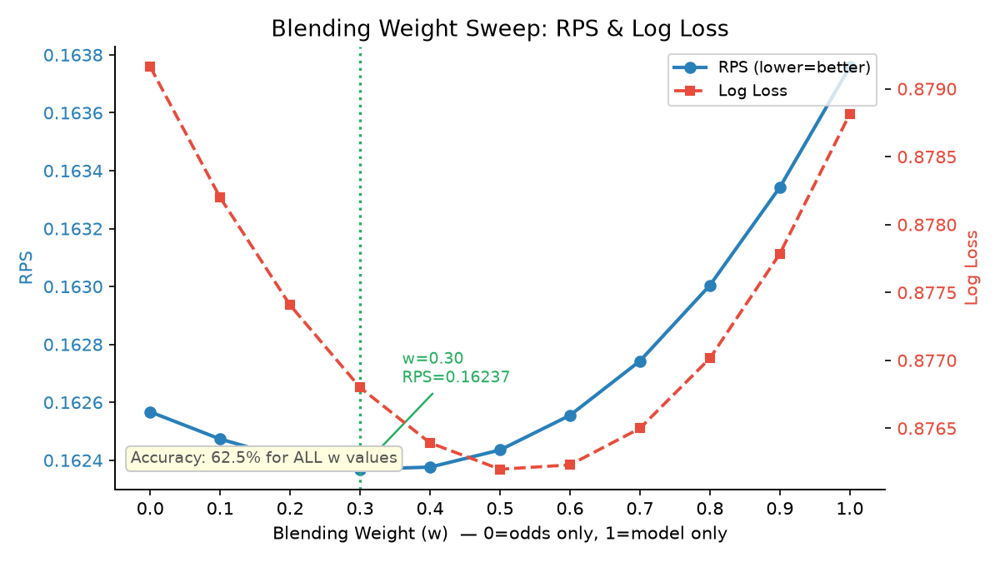
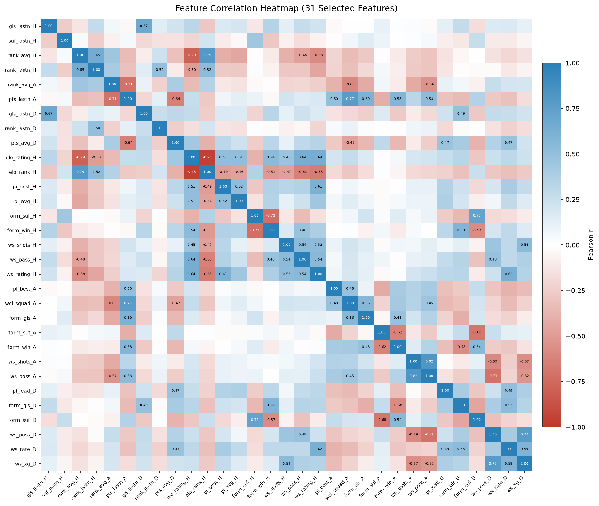
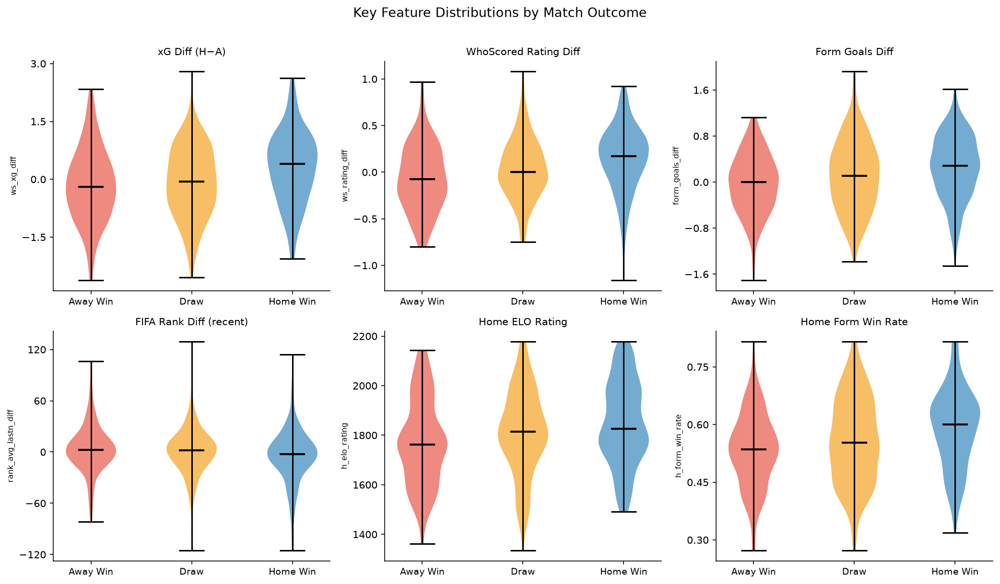
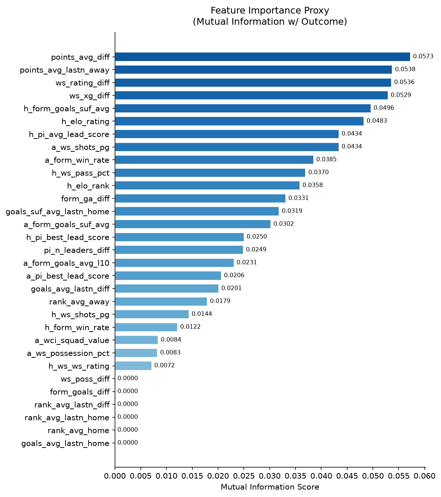
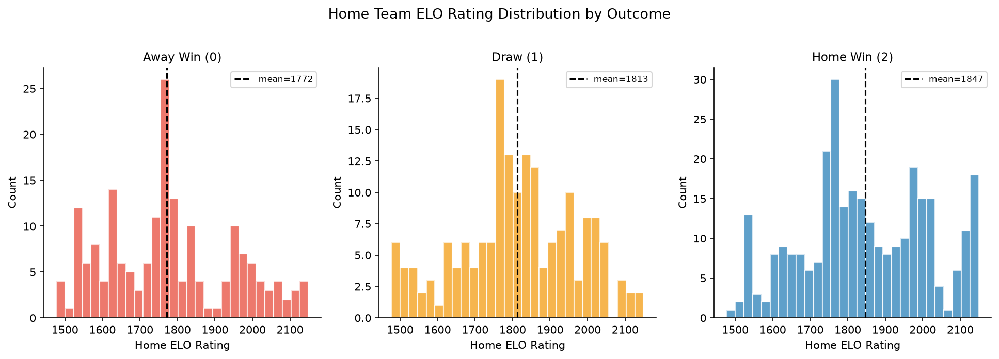
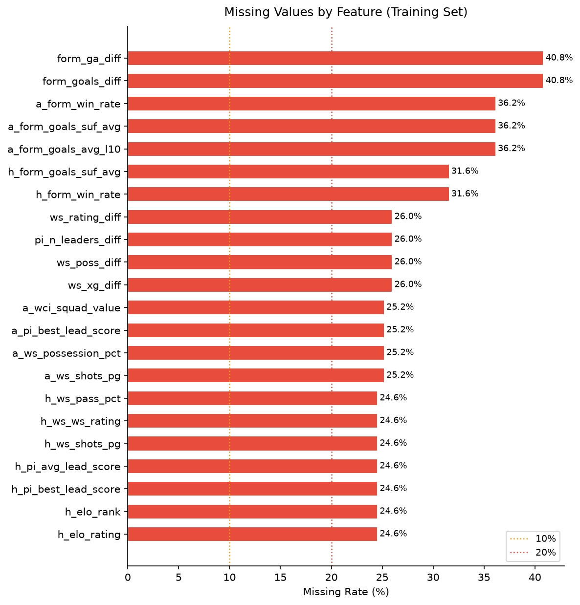

# 시각화 자료 설명 가이드

> 생성 스크립트: `final/visualize.py`  
> 데이터 기준: `final/out/train_base.parquet` (학습셋 896경기)  
> 피처 기준: `final/pred_cat/selected_features.csv` (31개 피처)

---

## 01 — 클래스 분포 (`01_outcome_distribution.png`)

### 무엇을 보여주나
학습 데이터 896경기의 실제 결과(홈팀 승·무·원정팀 승) 분포를 막대그래프로 표시한다.

### 수치
| 결과 | 경기 수 | 비율 |
|------|--------|------|
| Home Win | 402 | 44.9% |
| Away Win | 250 | 27.9% |
| Draw | 244 | 27.2% |

### 해석 포인트
- 홈팀 승이 전체의 45%로 가장 많다. 국제 A매치에서도 홈 어드밴티지가 명확하게 존재한다.
- 무승부와 원정 승은 비슷한 비율(약 27%)로 클래스 불균형이 약하게 존재한다.
- CatBoost의 `class_weights` 설정 없이도 학습이 안정적인 이유 중 하나다.

---

## 02 — 득점 포아송 적합 (`02_poisson_goals.png`)

### 무엇을 보여주나
홈팀/원정팀의 실제 경기당 득점 분포(막대)와 동일 평균 λ를 가진 포아송 분포(겹쳐진 막대)를 나란히 비교한다.

### 수치
| | λ (평균 득점) |
|--|--------------|
| 홈팀 | **1.487** |
| 원정팀 | **1.078** |

### 해석 포인트
- 두 분포 모두 포아송 분포와 형태가 유사하다 — 축구 득점이 포아송 과정으로 잘 모델링된다는 고전적 가정을 데이터가 지지한다.
- 홈팀이 원정팀보다 평균 약 0.41골 더 넣는다(홈 어드밴티지).
- 별도 `dl/` 파이프라인의 bivariate-Poisson 모델이 이 λ 추정을 기반으로 설계되었다.
- 0골 경기가 포아송 예측보다 약간 많은 경향이 있어(초과 분산), 무승부 예측이 어려운 원인 중 하나다.

---

## 03 — 블렌딩 가중치 스윕 (`03_blending_weight_sweep.png`)

### 무엇을 보여주나
모델-배당률 블렌딩 가중치 w를 0.0(배당률만)에서 1.0(모델만)까지 0.1 단위로 바꾸면서 측정한 RPS(파란 실선)와 Log Loss(빨간 점선)를 이중 y축으로 표시한다.

### 수치 (검증셋 48경기)
| w | RPS | Log Loss | Accuracy |
|---|-----|----------|----------|
| **0.30** | **0.16237** | 0.87680 | 62.5% |
| 0.40 | 0.16238 | 0.87639 | 62.5% |
| 0.00 (odds only) | 0.16257 | 0.87916 | 62.5% |
| 1.00 (model only) | 0.16376 | 0.87881 | 62.5% |

### 해석 포인트
- **Accuracy는 모든 w에서 62.5%로 동일하다.** 블렌딩이 승패 방향 자체를 바꾸지 않는다는 뜻으로, 모델이 이미 방향을 잡고 있고 배당률은 확률 크기(confidence)를 정제하는 역할만 한다.
- RPS 최솟값은 w=0.30 (모델 30% + 배당률 70%)이다. 시장 배당률이 여전히 강력한 신호임을 시사한다.
- 배당률만 쓴 w=0.00이 모델만 쓴 w=1.00보다 RPS가 약간 낮다 — 배당률 신호의 강도를 보여준다.
- RPS와 Log Loss의 최적 w가 미세하게 다른 점(RPS=0.30, LogLoss 최솟값≈0.50)은 두 지표가 측정하는 불확실성 측면이 다르기 때문이다.

---

## 04 — 피처 상관관계 히트맵 (`04_feature_correlation_heatmap.png`)

### 무엇을 보여주나
31개 선택 피처 간의 Pearson 상관계수를 색상(빨강=음의 상관, 흰색=0, 파랑=양의 상관)으로 표시한다. |r| > 0.45인 셀에는 수치를 직접 표기했다.

### 주목할 강한 상관 쌍
| 피처 쌍 | |r| | 의미 |
|---------|------|------|
| elo_rating_H ↔ elo_rank_H | 0.957 | ELO 레이팅과 ELO 랭킹은 사실상 같은 정보 |
| ws_shots_A ↔ ws_poss_A | 0.812 | 점유율이 높으면 슈팅도 많다 |
| elo_rank_H ↔ rank_avg_H | 0.793 | ELO 랭킹과 FIFA 랭킹은 유사 정보 |

### 해석 포인트
- ELO 관련 두 피처(elo_rating_H, elo_rank_H)의 r=0.96은 둘 중 하나가 중복 정보임을 뜻한다. CatBoost는 트리 기반이라 다중공선성에 강하지만, SHAP 해석 시 주의가 필요하다.
- 홈팀 지표(H)와 원정팀 지표(A) 간의 상관이 낮다는 점은 두 집합이 서로 독립적인 정보를 제공함을 의미한다.
- diff 지표(D)는 대부분 홈(H)과 양의 상관, 원정(A)과 음의 상관을 보이며 — 설계 의도대로 방향성이 잡혀 있다.

---

## 05 — 핵심 피처 결과별 바이올린 플롯 (`05_feature_violin_by_outcome.png`)

### 무엇을 보여주나
6개 핵심 피처 각각에 대해 Away Win / Draw / Home Win 세 그룹의 분포를 바이올린(밀도 + 사분위수) 형태로 비교한다.

### 피처별 해석
| 피처 | 관찰 패턴 |
|------|----------|
| **xG Diff (H−A)** | Home Win일수록 양수 방향으로 이동. 예측력이 가장 직관적인 피처 |
| **WhoScored Rating Diff** | xG Diff와 유사한 경향. 홈팀 우세 시 분포가 오른쪽 |
| **Form Goals Diff** | Away Win 그룹에서 음수 비중이 높음 |
| **FIFA Rank Diff (recent)** | 랭킹 차이가 클수록 강팀(홈팀) 승리 확률 증가 |
| **Home ELO Rating** | Home Win 그룹의 홈팀 ELO가 가장 높음(→ 07번 그래프와 연계) |
| **Home Form Win Rate** | Home Win 그룹에서 분포가 상향 편향 |

### 해석 포인트
- 무승부(Draw) 그룹의 분포가 Away Win과 Home Win 사이에 끼인 형태로, 무승부를 분리하기 어려운 구조임을 시각적으로 확인할 수 있다.
- xG Diff와 WhoScored Rating Diff가 결과 분리에 가장 효과적인 피처로 보이며, Mutual Information(06번) 결과와 일치한다.

---

## 06 — Mutual Information 피처 중요도 (`06_mutual_information.png`)

### 무엇을 보여주나
31개 피처 각각과 타깃(결과 0/1/2) 사이의 Mutual Information 점수를 수평 막대그래프로 표시한다. 모델 학습 없이 순수 정보량 기준의 중요도 지표다.

### 상위 5개 피처
| 순위 | 피처 | MI 점수 | 의미 |
|------|------|---------|------|
| 1 | `points_avg_diff` | 0.0573 | 홈-원정 포인트 누적 평균 차이 |
| 2 | `points_avg_lastn_away` | 0.0538 | 원정팀 최근 N경기 포인트 평균 |
| 3 | `ws_rating_diff` | 0.0536 | WhoScored 레이팅 차이 |
| 4 | `ws_xg_diff` | 0.0529 | xG 차이 |
| 5 | `h_form_goals_suf_avg` | 0.0496 | 홈팀 최근 폼 실점 평균 |

### 해석 포인트
- 전체 MI 값이 0.03~0.06 범위에 분포한다. 축구 결과 예측의 근본적인 불확실성을 반영하며, 단일 피처로 결과를 확정할 수 없음을 뜻한다.
- points_avg_diff(포인트 차이)가 1위 — 순수한 전력 격차가 가장 직접적인 신호다.
- WhoScored와 xG 기반 diff 피처들이 상위권에 다수 포진해, 외부 전력 지표가 FIFA 랭킹 기반 지표보다 정보량이 높다.
- ELO 피처(h_elo_rating, h_elo_rank)는 중간 순위 — 절대 전력보다 상대적 차이 피처가 더 유효함을 시사한다.

---

## 07 — ELO 레이팅 결과별 분포 (`07_elo_by_outcome.png`)

### 무엇을 보여주나
홈팀 ELO 레이팅을 결과 세 그룹(Away Win / Draw / Home Win)별로 나눈 히스토그램. 각 그룹의 평균값을 점선으로 표시했다.

### 수치
| 결과 | 홈팀 ELO 평균 |
|------|--------------|
| Home Win | **1847.3** |
| Draw | 1812.9 |
| Away Win | 1771.6 |

### 해석 포인트
- 홈팀 ELO가 높을수록 홈 승리 빈도가 높아지며, 그룹 간 평균 차이가 약 75 포인트다.
- Away Win 그룹에서도 홈팀 ELO가 낮지 않다 — 전력 하위 홈팀도 상당히 많이 패한다는 의미로, ELO 단독으로는 예측이 제한적임을 보여준다.
- 세 분포가 겹치는 구간이 넓어 ELO만으로는 분류가 어렵고, 다른 피처들과의 앙상블이 필요하다.

---

## 08 — 피처별 결측치 비율 (`08_missing_values.png`)

### 무엇을 보여주나
31개 선택 피처의 결측치 비율을 수평 막대그래프로 표시한다. 10% 초과(주황)·20% 초과(빨강) 기준선을 표시했다.

### 주요 고결측 피처
| 피처 | 결측률 | 원인 |
|------|--------|------|
| `form_goals_diff` | 40.8% | 폼 통계 기반 diff — 초기 경기 부족 팀 |
| `form_ga_diff` | 40.8% | 동일 원인 |
| `a_form_goals_suf_avg` | 36.2% | 원정팀 최근 폼 실점 — 신흥국 데이터 부족 |
| `a_form_win_rate` | 36.2% | 원정팀 폼 승률 |
| `a_form_goals_avg_l10` | 36.2% | 원정팀 최근 10경기 득점 |

### 해석 포인트
- 결측은 주로 **원정팀 폼·diff 피처**에 집중된다. 데이터가 적은 소규모 국가 팀이 원정으로 경기할 때 이력이 부족하기 때문이다.
- CatBoost는 결측치를 `NaN`으로 그대로 입력해도 분기 처리하므로, 별도 대체 없이 학습한다.
- 2026 WC 예측 데이터(72경기)도 동일 결측 패턴을 가지므로 훈련-추론 간 분포 일관성은 유지된다.
- 결측률이 높은 폼 피처들이 Mutual Information에서 중상위권에 있다는 점은, 데이터가 있을 때의 정보량은 크지만 커버리지가 낮다는 트레이드오프를 의미한다.

---

## 파일 목록 요약

| 번호 | 파일명 | 주제 | 발표 활용 슬라이드 |
|------|--------|------|-----------------|
| 01 | `01_outcome_distribution.png` | 클래스 분포 | 슬라이드 4 (전처리) 또는 슬라이드 8 |
| 02 | `02_poisson_goals.png` | 포아송 득점 적합 | 슬라이드 6 (모델) 또는 슬라이드 10 |
| 03 | `03_blending_weight_sweep.png` | w별 RPS·LogLoss | **슬라이드 7 (블렌딩)** |
| 04 | `04_feature_correlation_heatmap.png` | 피처 상관관계 | 슬라이드 5 (피처) |
| 05 | `05_feature_violin_by_outcome.png` | 결과별 피처 분포 | 슬라이드 5 (피처) |
| 06 | `06_mutual_information.png` | MI 기반 중요도 | 슬라이드 5 (피처) |
| 07 | `07_elo_by_outcome.png` | ELO vs 결과 | 슬라이드 5 또는 슬라이드 3 |
| 08 | `08_missing_values.png` | 결측치 현황 | 슬라이드 4 (전처리) |
